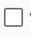
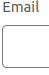
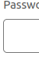

# Cloudflare Account Generator Demo

A demonstration of automated Cloudflare account creation using image recognition, powered by the `stealth-browser-controller` library.

## Overview

This demo showcases how to automate the Cloudflare account creation process using screen-based element detection instead of traditional browser automation APIs like Selenium.

## How it Works

The automation process follows these steps:

1. Generates a random email address
2. Opens the Cloudflare signup page
3. Locates and clicks the signup button
4. Fills in the email field
5. Fills in the password field
6. Submits the form

## Element Detection

The demo uses the following reference images to locate and interact with page elements:

*Initial button to start signup*

*Field for entering email address*

*Field for entering password*

*Button to submit the form*

*Image used to verify successful completion*

## Demo Video

Here you can see the demo video:

https://github.com/user-attachments/assets/43d7762c-2e4b-432c-b11f-8ba6e5b2b6c1

