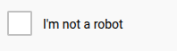
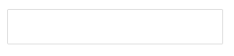

# Stealth Browser Controller Demo

A demonstration of automated reCAPTCHA solving using image recognition and system audio recording, powered by the `stealth-browser-controller` library.

## Overview

This demo showcases an alternative approach to solving reCAPTCHA challenges without traditional browser automation APIs like Selenium. Instead, it uses screen-based element detection and system audio recording.

## How it Works

The automation process follows these steps:

1. Locates and clicks the reCAPTCHA checkbox using image recognition
2. If human verification is required:
   - Switches to audio challenge mode
   - Records system audio during challenge playback
   - Uses speech recognition to convert audio to text
   - Submits the transcribed answer

## Element Detection

The demo uses the following reference images to locate and interact with reCAPTCHA elements:

*Initial checkbox to start the challenge*

*Button to switch to audio challenge mode*

*Button to play the audio challenge*

*Text field for submitting the transcribed answer*

*Button to submit the answer*

*Image used to verify successful completion*

## Demo Video

Here you can see the demo video:

https://github.com/user-attachments/assets/2c2993b9-25b9-4576-92a1-505b04125c0f

